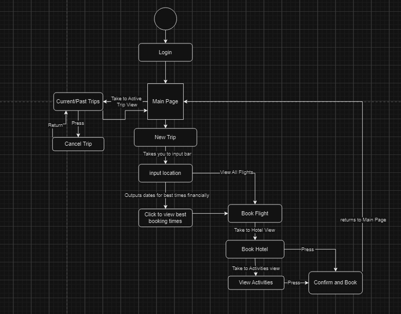
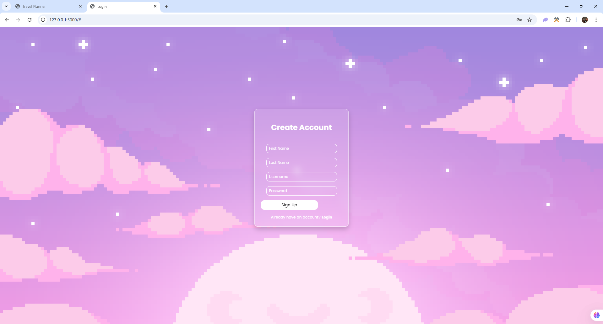
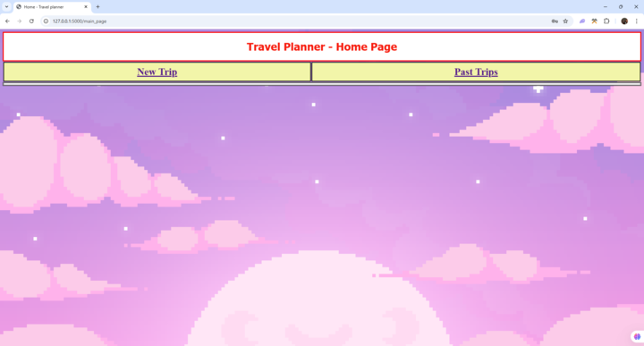
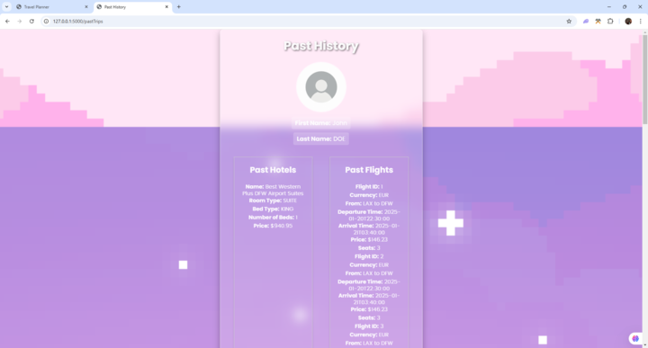
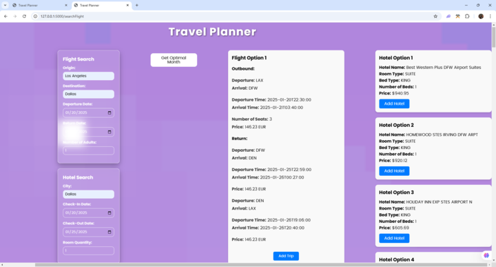
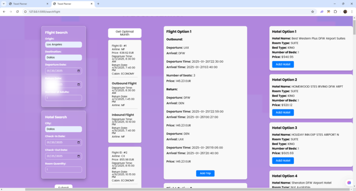
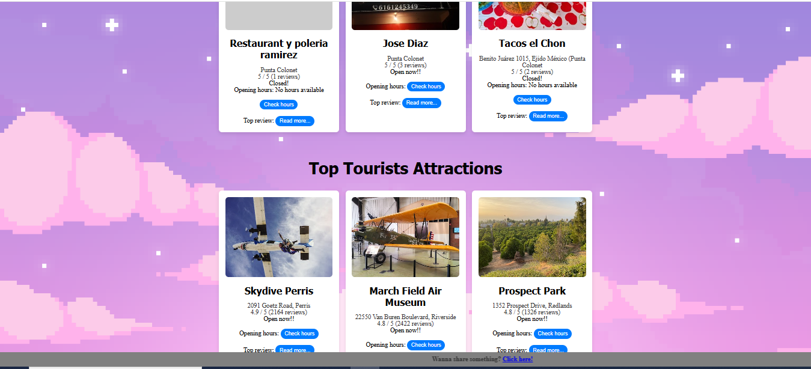

## VACATION PLANNER
> Authors:
> \<[Max Steins](https://github.com/MaxSteins36)\>

## Project Description
- **General Description**
   This is a trip planning software that will allow users to get information regarding flights, hotels, and hopefully events/activities to do wherever they are planning to travel.

- **Why is it important or interesting to you?**  
  This project is particularly interesting to our group because it allows us to explore several key areas of computer science, including data management, web development, and software engineering.

- **What languages/tools/technologies do you plan to use?**  
  We plan to use Python, HTML, JavaScript, C++, and potentially SQL. This list may evolve as the project progresses.

- **What will be the input/output of your project?**  
  The input is the user's location, and the outputs are airplane tickets, hotels, and nearby activities.

- **What are the features that the project provides?**  
  The project will include features such as:
  - User login functionality
  - Past trip history page
  - Booking of tickets and hotels
  - Viewing of nearby activities
  - Potential itinerary management

---

## User Interface Specification

### Navigation Diagram

### Screen Layouts
[View Screen Layout](./Screen%20Layout.pdf)

## Class Diagram

.drawio.png)

Login page: Where the user can either make a new account or log in.

Create new account page allows users to register for a new account by providing the necessary information: first and last name, username, and password.

After successfully login, the main page gives 2 options: plan a new trip or review past trip.

The past trip option shows user info and their last (previous) trip information.

The new trip option takes input (dummy as displayed) and then shows the available information for the input received.

The optimal month option on the new trip page lets you choose the month to evaluate the best options.

Then return the output as follows:

Click the activities button from the new trip page:

 
 ## Installation/Usage
To install this program you need to have a flask extension, python extensio, sqlite extension, requests library and asyncio. To use this program you would login or sign up in the main page. The login feature checks if your current information exists in the database, if so it takes you to the main page. In sign up it adds you to the database and returns you to the login page. After you're in the main page you have the option of viewing your past trips associated with your specific user ID given to you on account creation or searching flights or hotels. When you go to search flights or create new trips you enter the relevant api data which is similar to the data of your trip like departure date, return date etc. After that you will be able to see what flights and hotels are available. If you want to see the best deals, you can go to optimal month and select month and it will return the best prices for each cabin within that month. The add button functionality adds the flights and hotels to the database. 
 ## Testing
We used pytest to test all the python files that connected to the javascript. Due to inefficiency of calling the API as well as the different outputs it would return, we made mock classes to simulate API calls and then tested functions with it and validated the outputs to make sure it worked for the HTML and JS. Unfortunately, not all are tests are passing but that is because we haven't been able to make mock classes for certain API calls and the different user inputs is changing the results and making it fail.
 
 
